# 哔哩哔哩-日常任务

## 功能
- 集成钉钉推送
- 日志推送与任务剥离
- 多任务执行

## 使用
### node环境
配置  /config.json文件
```json
{
  "cookie": "",
  "ding": {
    "webhook": "",
    "secret": ""
  }
}
```
cookie 在[bilibili](https://www.bilibili.com/) 官网登录后，控制台找到接口获取
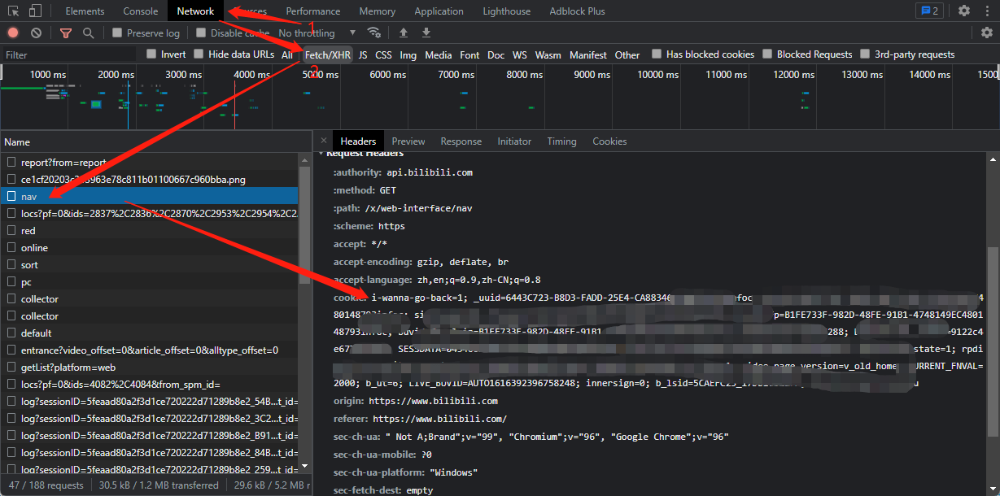

ding 配置

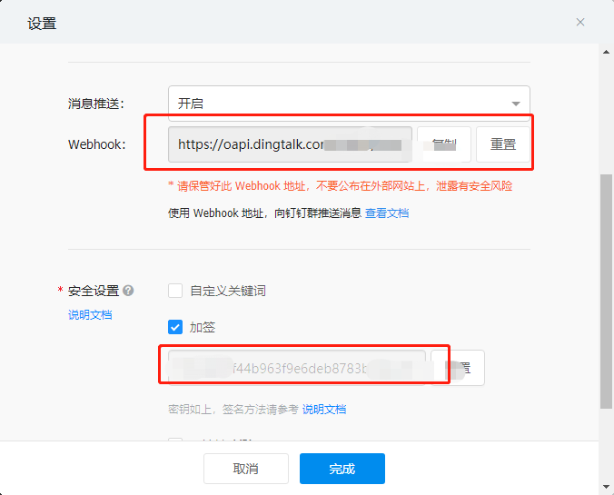

备注：__默认在node环境运行__

### [腾讯云函数配置](https://console.cloud.tencent.com/)

1. 下拉项目或者 download zip

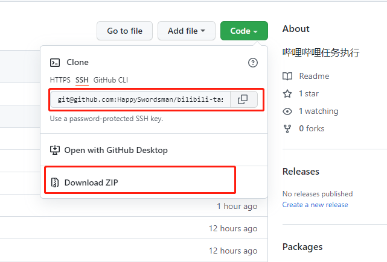

2. 函数执行入口修改 /index.js

```javascript
const app = require('./app');

exports.main = async (event, context) => {
    await app();
  };
  
```
3. 新建云函数服务
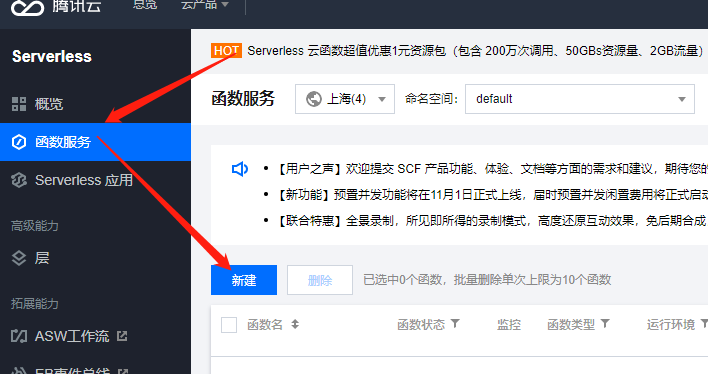
   
4. 配置云函数服务
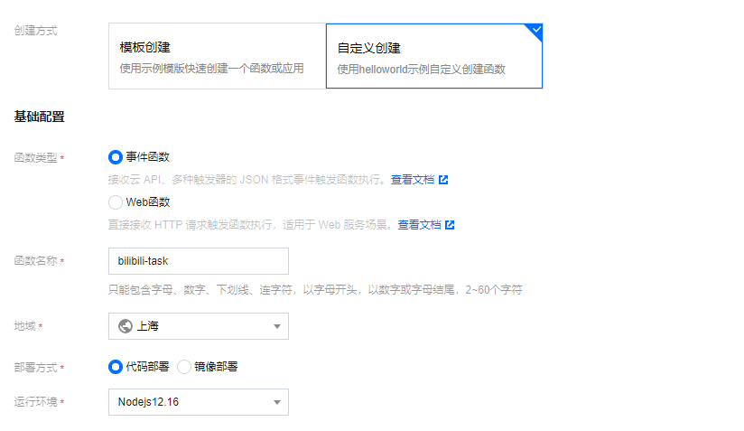
   
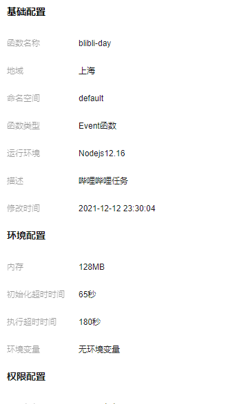

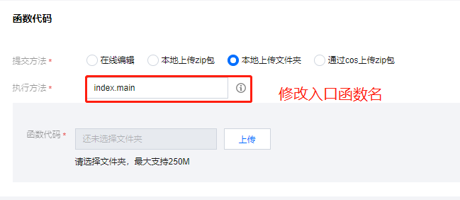

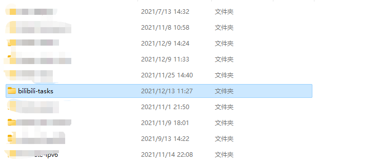

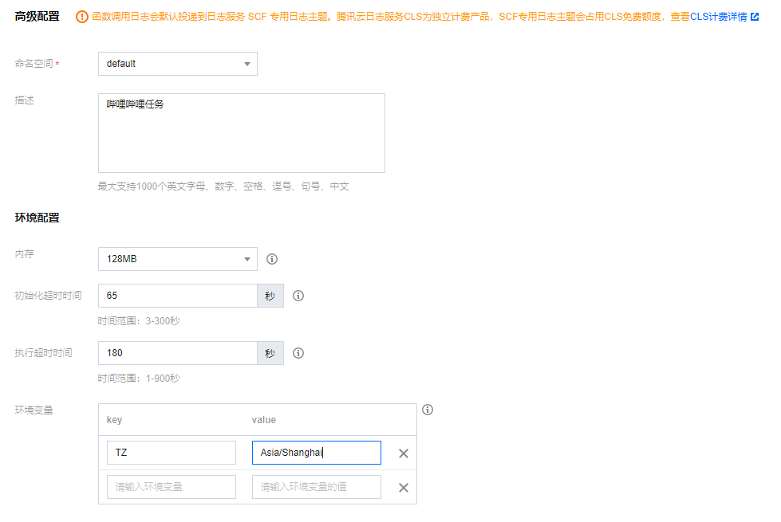

触发时间：每天早上 7:30  __0 30 7 * * * *__

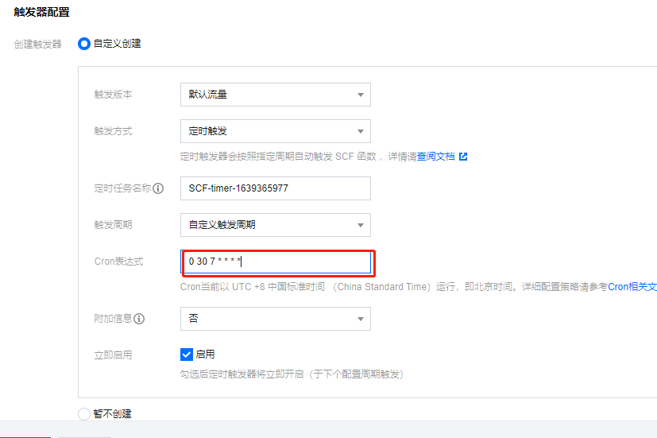

4. 配置完成后的云函数代码

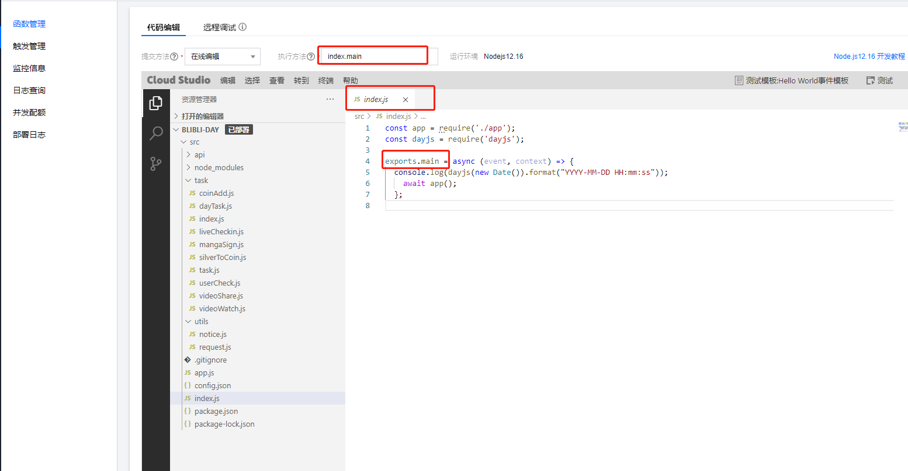
   
记得一定要安装依赖哦

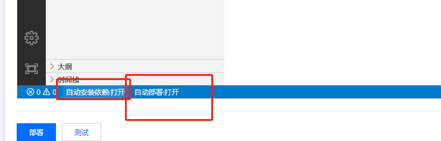

测试时记得投币任务中投币注释了，避免投币过多，测试完成后解除注释，放心跑就行了

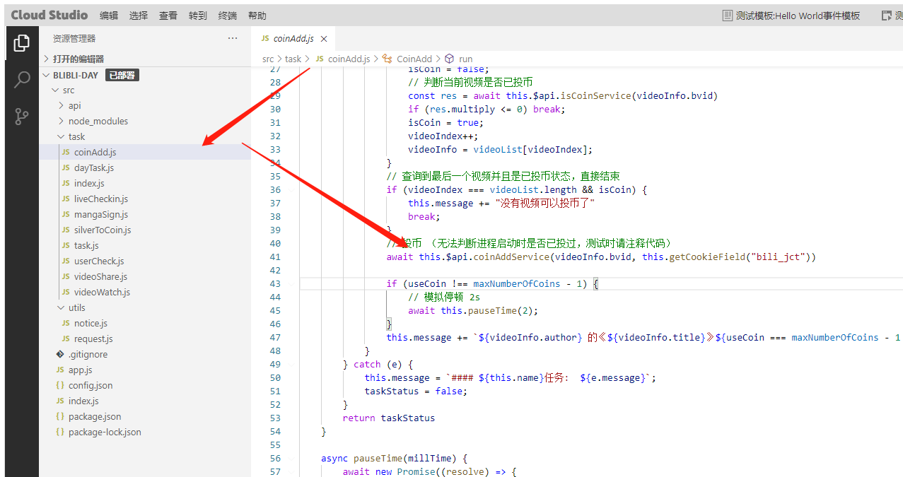

_关于腾讯云函数时间显示不准确问题_

设置函数配置的环境变量

```
TZ=Asia/Shanghai
```

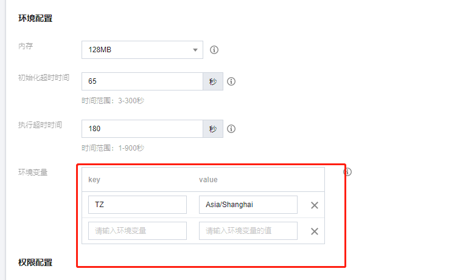
